## About

These files were created as part of the course
*Build a computer on Coursera*
https://www.coursera.org/learn/build-a-computer

Book pdf, lecture pdfs, tools code and projects were provided
code in projects was modified to make a working computer and 
the notes are here to make sure a quick review of all content 
is available.

## More info:
www.nand2tetris.org and the book "The Elements of Computing Systems"
by Nisan and Schocken, MIT Press.


## Convert from Decimal to Binary
- for even number write 0
- for odd number write 1
- divide by 2 and throw away the reminder
- if quotient is 0 algorithm is complete
- if it is not 0 and not odd insert one 
- if number is even prefix with 0
- go back to the third step

## Adding Binary
```
  1011
+  111
======
 10010
```
## Binary Multiplication
```
    1001
*    101
========
    1001
   0000
  1001
========
  101101
```
  
## Hexadecimal to Decimal
```
0 1 2 3 4 5 6 7 8 9 A B C D E F
AF3 = 10*16^2 + 15 * 16^1 + 3 * 16^0 = 2803
```
## Binary to Hexadecimal
Group the numbers in four numbers (they represent 0-16)
```
1011 0110 1111 Binary
==============
  11    6   15 Decimal
==============
   B    6    F Hexadecimal
```


## Binary Negative Numbers - 2's complement
```
0000  0
0001  1
0010  2
0011  3
0100  4
0101  5
0110  6
0111  7
-------
1000 -8
1001 -7
1010 -6
1011 -5
1100 -4
1101 -3
1110 -2
1111 -1
```
Negative numbers begin with 1 and 
Positive numbers begin with 0

## Binary from Positive to Negative - two ways to calculate it

Flip all bits and add 1
```
 0101  5
 ====
 1010 -6
+   1
 ====
 1011 -5 
```
Substract the number from all 1111 and add 1
```
  1111
- 0100  4
  ====
  1011
+    1
  ====
  1100  -4
```


## Boolean logic
```
. = AND
+ = OR
```
Example:
```
NOT(0 OR (1 AND 1))=
NOT(0 OR 1)=
NOT(1)=
0
```

## Boolean function
`f(x, y, z) = (x AND y) OR (NOT (x) AND z)`

## Truth table
```
 x | y | z | f
===|===|===|===
 0 | 0 | 0 | 0
 0 | 0 | 1 | 1
 0 | 1 | 0 | 0
 0 | 1 | 1 | 1
 1 | 0 | 0 | 0
 1 | 1 | 0 | 1
 1 | 1 | 1 | 1
```


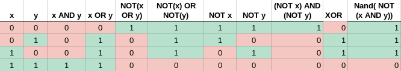

When writing down the Boolean expression from the truth table take only the lines where the f = 1 and OR all of them. Example bellow:
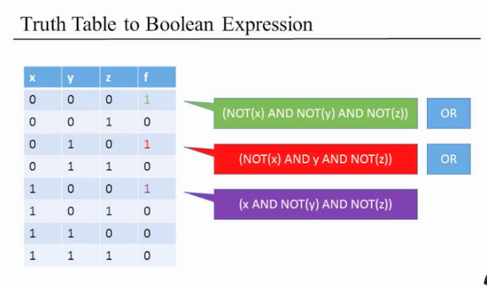


## Boolean Algebra Laws
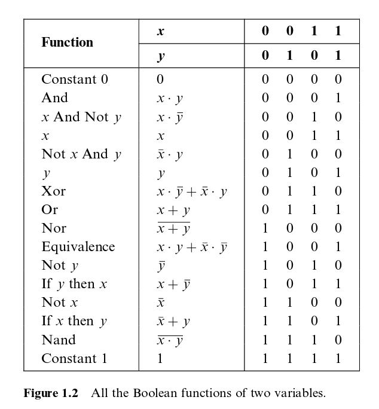

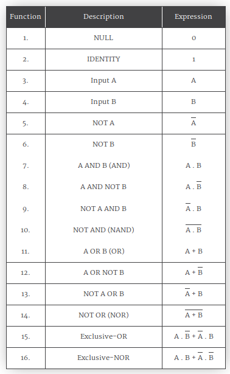

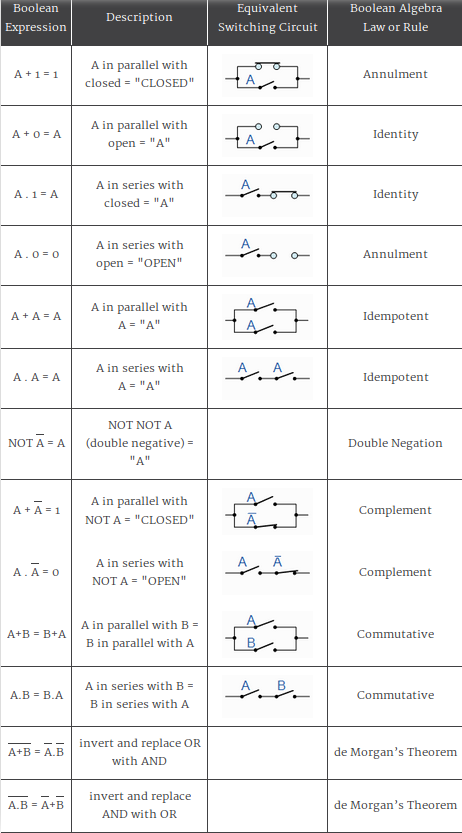


**Any boolean function can be represented using an expression containing AND and NOT operators.**

```
x OR y = NOT(NOT(x) AND NOT(y))
```


## NAND 
```
 x | y | output 
===|===|===
 0 | 0 | 1 
 0 | 1 | 1 
 1 | 0 | 1 
 1 | 1 | 0 
```

```
NOT(x AND x) = NOT(x) = x NAND x
(x NAND y) = NOT(x AND y)
NOT(x) = (x NAND x)
x AND y = NOT(x NAND y)
```

## AND
y = AB = A.B
True if both inputs are true.
```
 x | y | output 
===|===|===
 0 | 0 | 0 
 0 | 1 | 0 
 1 | 0 | 0 
 1 | 1 | 1 
```

## 16-bit bitwise AND
```
a    0100111000111101
b    1111001100011010
=====================
AND  0100001000011000
```


## OR
y = A+B
True if either or both inputs are true. 
```
 x | y | output 
===|===|===
 0 | 0 | 0 
 0 | 1 | 1 
 1 | 0 | 1 
 1 | 1 | 1 
```

## 16-bitwise OR
```
a    0110110011100101
b    1001110100101011
=====================
OR   1111110111101111
```

## XOR - Exclusive OR
True if either but not both inputs are true. 
```
 x | y | output 
===|===|===
 0 | 0 | 0 
 0 | 1 | 1 
 1 | 0 | 1 
 1 | 1 | 0 
```

## NOT

```
 x | x | output 
===|===|===
 0 | 0 | 1 
 0 | 1 | -
 1 | 0 | -
 1 | 1 | 0 
```
## 16-bitwise NOT
```
a    1011010010110011
=====================
NOT  0100101101001100
```

## NOR 
Output is true if both inputs are false.
```
 x | x | output 
===|===|===
 0 | 0 | 1 
 0 | 1 | 0
 1 | 0 | 0
 1 | 1 | 0 
```
## XNOR gate
Negated A+B
True if outputs are the same and false if they are different
```
x | x | output 
===|===|===
 0 | 0 | 1 
 0 | 1 | 0
 1 | 0 | 0
 1 | 1 | 1 
```


Gate Logic

A technique for implementing Boolean functions using logic gates.

Logic gates:
- Elementary (Nand, And, Or, Not ...)
- Composite (Multiplexer, Demultiplexer, Half-Adder, Full-Adder, Incrementer ...)


## Nand
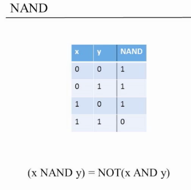

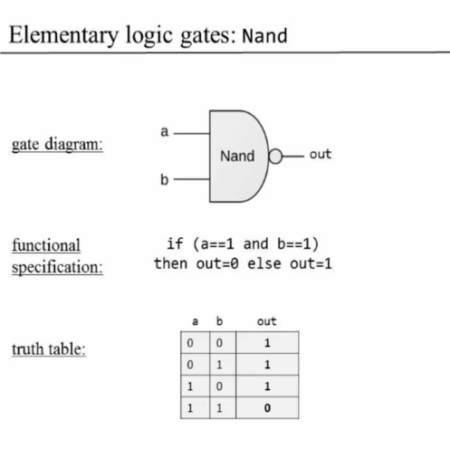

## And, Or, Not
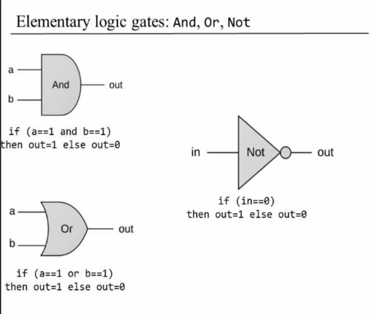

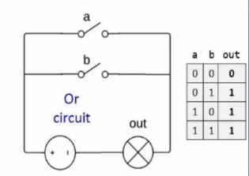

## Xor
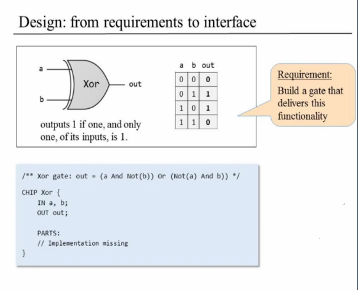

## Composite Gates
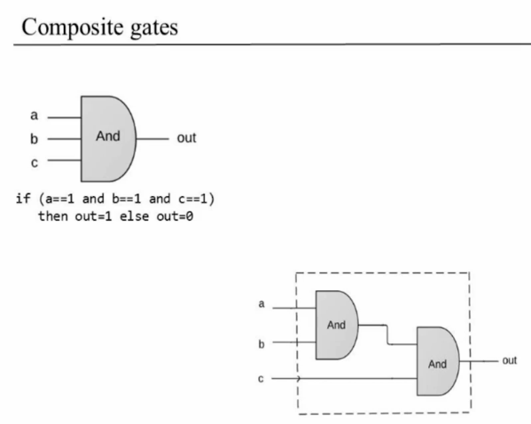

## Multiplexor
```
inputs = a,b, sel
output = out
if (sel == 0)
    out = a
else
    out = b
```


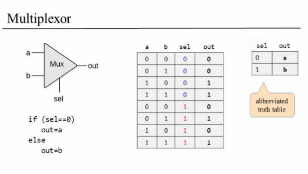

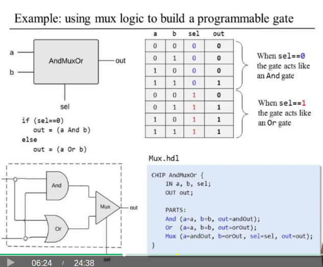

## Demultiplexor
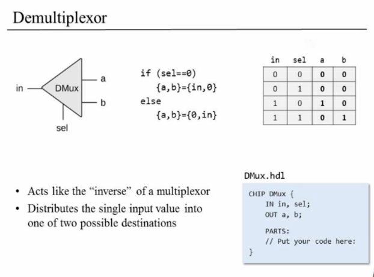

```
m = selection
c = outputs
n = 2^m
m = log2n
```
## Half-adder
Designed to add two bits.
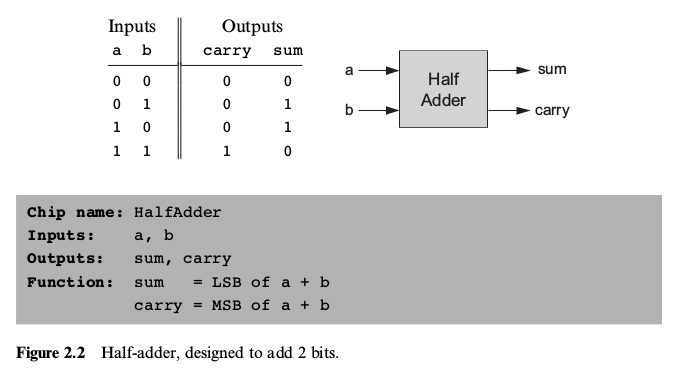

## Full-adder
Designed to add three bits.
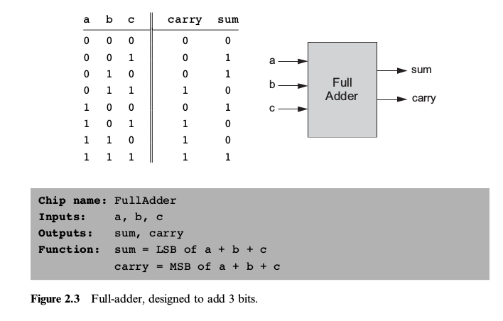
## Adder
Designed to add two n-bit numbers (n being 16, 32, 64, and so forth—depending on the computer platform.).
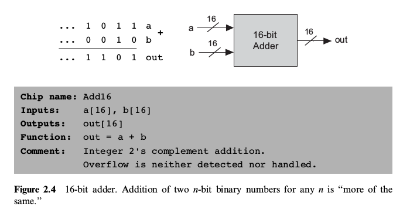

## The Hack ALU
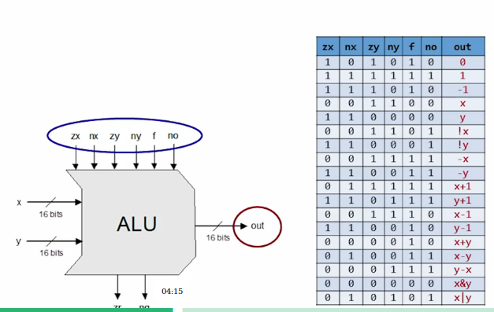

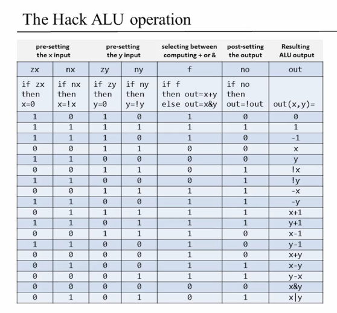


### Hardware simulation
Run hardware simulator (files in tools)
`bash HardwareSimulator.sh`
`bash Assembler.sh`
`bash CPUEmulator.sh`


### Simulation proces

- Load the HDL file into the hardware simulator
- Enter values (0s and 1s) into the chip's input pins
- Evaluate the chip's logic
- Inspect the resulting values of the output pins (eg. out) and internal pins (nota, notb, aAndnotb, notaAndb)

### Testing scripts

- Load the HDL and test script files
- Run the script
- Check if there were any errors


### Simulation with compare file logic

When each output command is executed, the outputted line (.out) is compared to the corresponding line in the compare file (.cmp)
If the two lines are not the same, the simulator throws a comparison error


Test script = series of commands to the simulator

### Multi-bit Buses

Multi-bit busses are indexed right to left
If A is a 16-bit bus then A[0] is the right-most bit and A[15] is the left most bit

0 1 0 1 1 1 1 1 1 1 1 1 0 0 0 1

A[0] lsb - least significant bit
A[15] msb - most significant bit

## Address inputs
```
k(width of address input)
k=log2n
8=log23

k= logn/log2
log64/log2 = 6
log512/log2 = 9
```
- load 0 = read
- load 1 = write 

```
RAM		n		k
===================
RAM8	8		3
RAM64	64		6
RAM512	512		9
RAM4K	4096	12
RAM16K	16384	14
```


## Assembly example
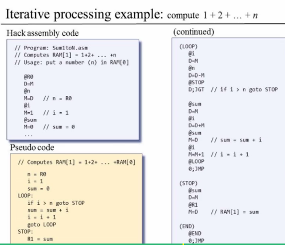

## Program development process
Best practice is short, efficient, elegant and self-describing code.

1. Design the program with pseudo-code
2. Write the program in code
3. Test the program using a variable and trace it on paper or test it

## Tracing
```
		0 | 1 | 2 | 3 | 4 | ...
===============================
RAM[0]	3 |
n		3 |
i		1 | 2 | 3 | 4 | ...
sum		0 | 1 | 3 | 6 | ...
```